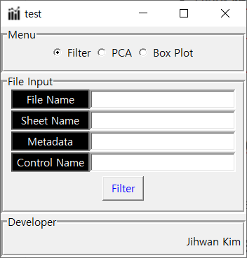
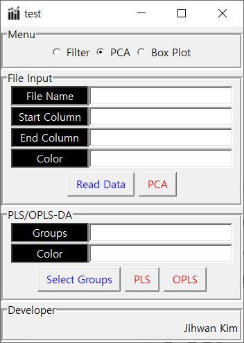
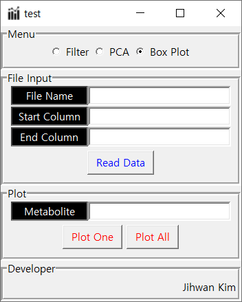
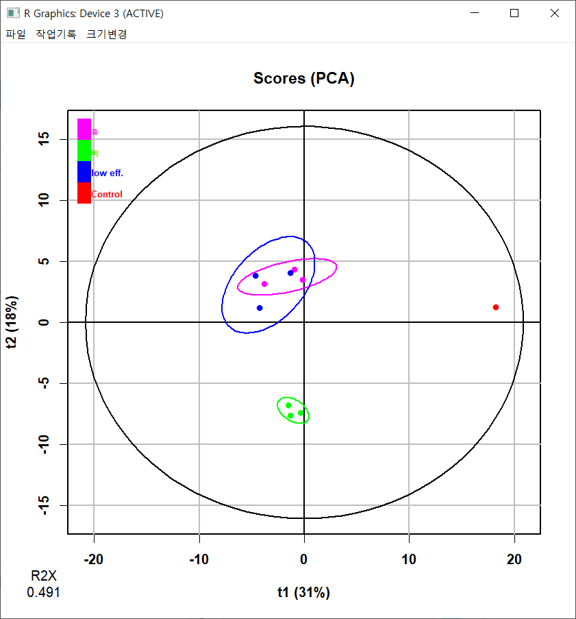
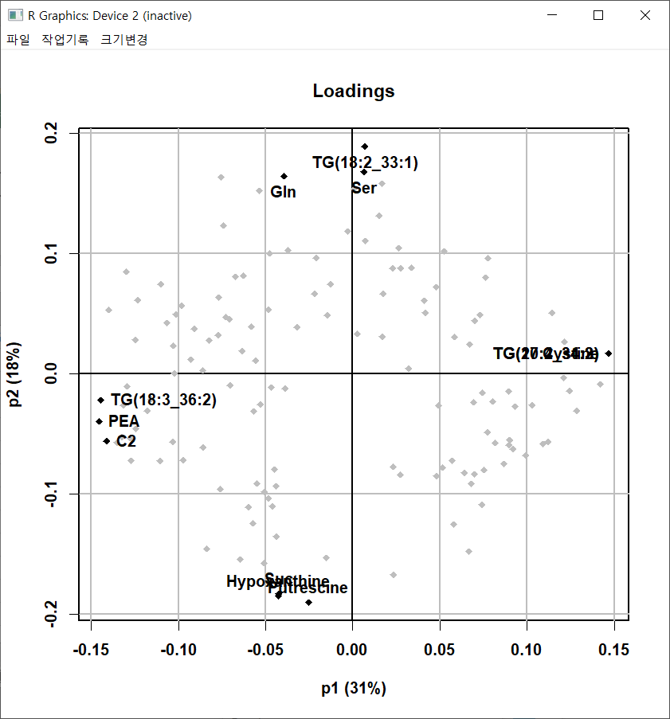
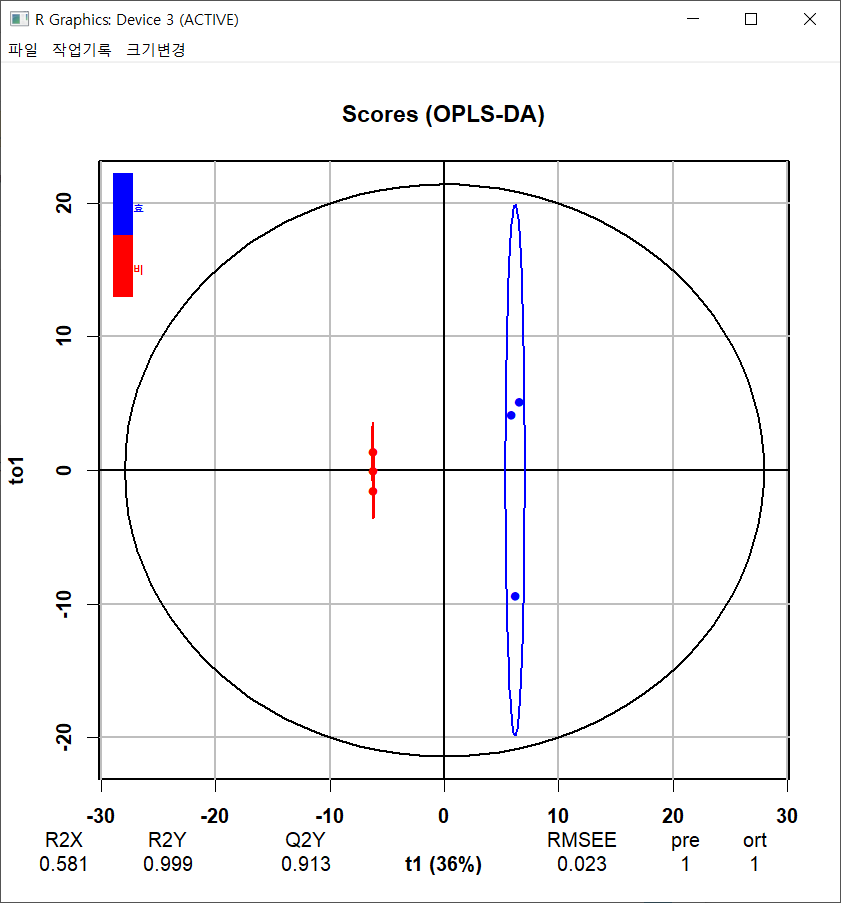
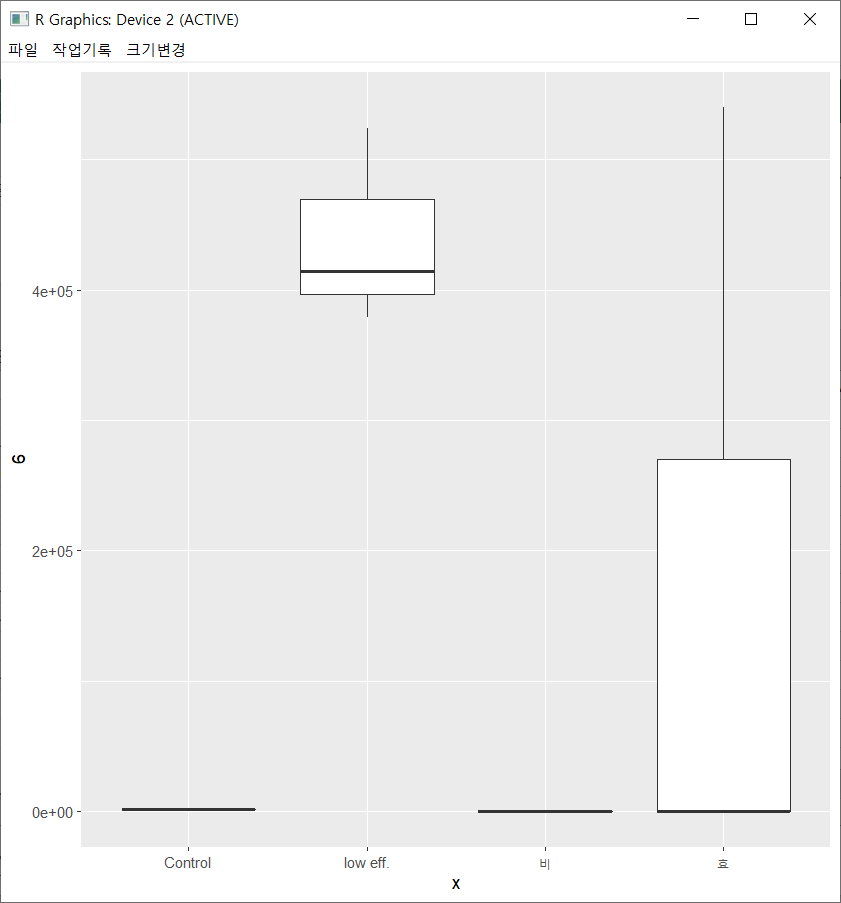

# PCA/OPLS-DA

Python code used to make executable program using **auto-py-to-exe**.

Can perform filtering, PCA, and OPLS-DA using **GUI**.

## Overview

- Used **rpy2** package to run **R** based code on python. 
- Used **ropls** package in R to perform PCA and OPLS-DA

- Used **tkinter** to create GUI for the program

## Usage

- Run **InstallRPackage.py** in local.bat. It will install all R packages needed for program.
- Use **auto-py-to-exe** to create executable file.
- Put excel sheets in **Data** folder and run the program. 

## Interface

### 1. filter

    

Delete all columns that are in the same group with "Control" based on t-test. 

- **File Name**: name of the excel file.
- **Sheet Name**: name of the sheet containing data. 
- **Metadata**: column index in excel that contains metadata.
- **Control Name**: row number in excel that contains 
- **Filter**: Creates new excel file named "File Name_filtered" in **Data** directory.

### 2. PCA

    

Performs PCA, PLS-DA, and OPLS-DA on selected data/group.

- **File Name**: name of the excel file.
- **Start Column**: starting column to perform PCA on.
- **End Column**: last column to perform PCA on.
- **Color**: customize color for each group.
- **Read Data**: read data based on the information above
- **PCA**: perform PCA and show graph on screen. 
- **Groups**: select groups for PLS-DA, OPLS-DA.
- **PLS/OPLS**: perform PLS-DA/OPLS-DA and show graph on screen. 

### 3. Box Plot

    

Creates box plot of selected/all metabolites.

- **File Name, Start Column, End Column, Read Data**: same with above. 
- **Metabolite**: choose one column(Metabolite) for box plot. 
- **Plot One**: create box plot for selected metabolite.
- **Plot All**: create box plot for all metabolite. 

## Screenshots

### 1. PCA

    
    

 

### 2. PLS-DA/OPLS-DA

    
    

### 3. Box Plot

    

